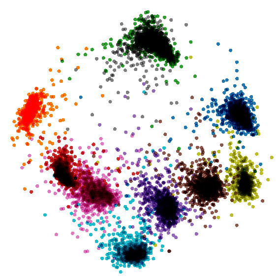

# Additive Angular Margin Loss #

Additive Angular Margin Loss (arcloss) used in MNIST dataset for the porpose of showing the difference in embeddings
topology between training with softmax and softmax along with arcloss.

##### Versions for Tensorflow 1.14 and 2.0 #####

### Features: ###
1. softmax training
2. arcloss training
3. fine-tuning of softmax with arcloss
4. Tensorboard visualizations

##### Tensorflow 1.14: #####
```
python3 mnist.py
```
Visualization of scalars and embeddings using:
```tensorboard --logdir path/to/logs_mnist```
##### Tensorflow 2.0: #####
```
python3 mnist_tf2.0.py
```
Visualization of scalars using: 
```tensorboard --logdir path/to/logs_mnist```

For embeddings visualization upload the two .tsv files generated under "logs_mnist" directory to [Embedding Projector](https://projector.tensorflow.org/)

2D Embedding visualization(PCA) with softmax             |  2D Embedding visualization(PCA) with softmax + arcloss
:-------------------------:|:-------------------------:
  |  


### Resources ###

* ArcFace: Additive Angular Margin Loss for Deep Face Recognition [paper](https://arxiv.org/pdf/1801.07698.pdf)
* Official implementation of deepinsight/insightface on [github](https://github.com/deepinsight/insightface)
