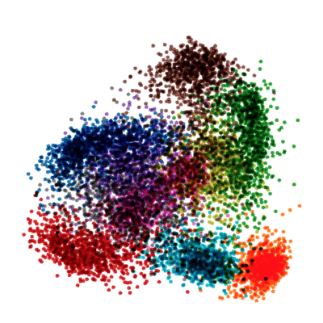
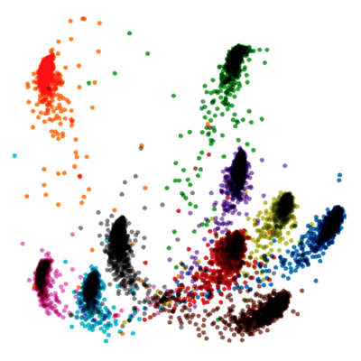

# Additive Angular Margin Loss #

Additive Angular Margin Loss (arcloss) used in MNIST dataset for the porpose of showing the difference in embeddings
topology between training with softmax and softmax along with arcloss.

Implemented in Tensorflow v 1.14.  
Arcloss keras layer is transferable to Tensorflow 2.0

Features:
1. softmax training
2. arcloss training
3. fine-tuning of softmax with arcloss
4. Tensorboard visualizations

   
2D Embedding visualization(PCA) with softmax &nbsp;&nbsp;&nbsp;&nbsp;&nbsp;&nbsp;&nbsp;&nbsp;&nbsp;&nbsp;&nbsp;&nbsp;&nbsp;&nbsp;&nbsp;&nbsp;&nbsp;&nbsp;&nbsp;&nbsp;&nbsp;&nbsp;&nbsp;&nbsp;&nbsp;&nbsp;&nbsp;&nbsp;&nbsp;&nbsp;&nbsp;&nbsp;&nbsp;&nbsp;
 2D Embedding visualization(PCA) with softmax + arcloss

#### Resources ####

* ArcFace: Additive Angular Margin Loss for Deep Face Recognition [paper](https://arxiv.org/pdf/1801.07698.pdf)
* Official implementation of deepinsight/insightface on [github](https://github.com/deepinsight/insightface)
