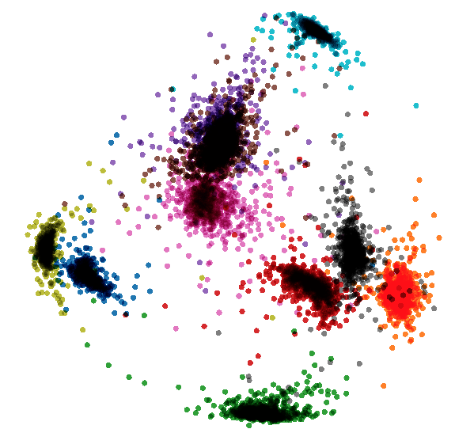

# Modification of SoftMax layer to distribute features on a hypersphere #

VGG16 Training using MNIST dataset to show the difference in feature
PCA visualization between SoftMax and modified SoftMax.

##### Versions for Tensorflow 1.14 and 2.0 #####

### Contents: ###
1. SoftMax training
2. modified SoftMax training
3. fine-tuning of SoftMax with modified SoftMax
4. Tensorboard visualizations

##### Tensorflow 1.14: #####
```
python3 mnist.py
```
Visualization of scalars and features using:
```tensorboard --logdir path/to/logs_mnist```
##### Tensorflow 2.0: #####
```
python3 mnist.py
```
Visualization of scalars using: 
```tensorboard --logdir path/to/logs_mnist```

For feature visualization upload the two .tsv files generated under "logs_mnist" directory to [Embedding Projector](https://projector.tensorflow.org/)

2D Feature visualization(PCA) with SoftMax training             |  2D Feature visualization(PCA) with modified SoftMax training
:-------------------------:|:-------------------------:
  |  


### Resources ###

* ArcFace: Additive Angular Margin Loss for Deep Face Recognition [paper](https://arxiv.org/pdf/1801.07698.pdf)
* Official implementation of deepinsight/insightface on [github](https://github.com/deepinsight/insightface)
